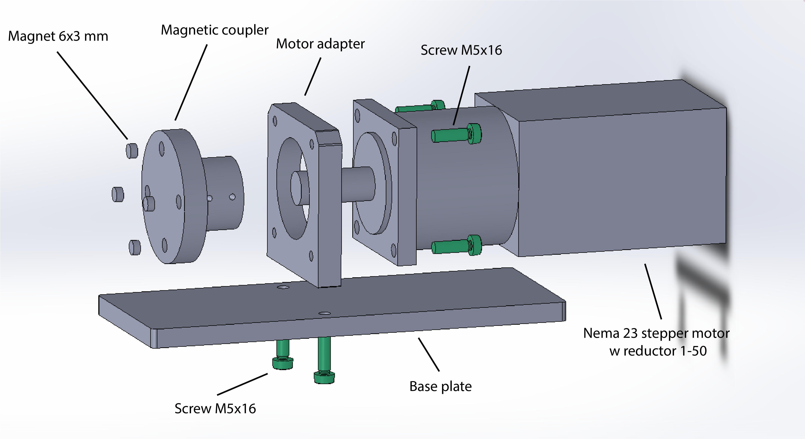
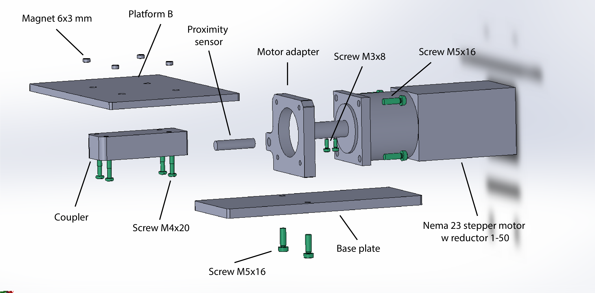
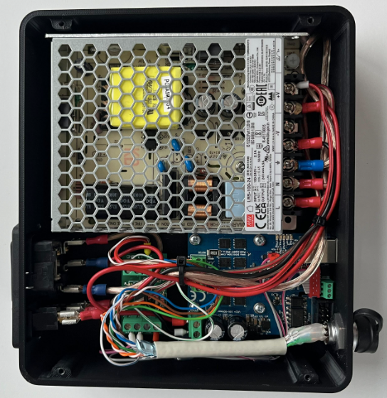
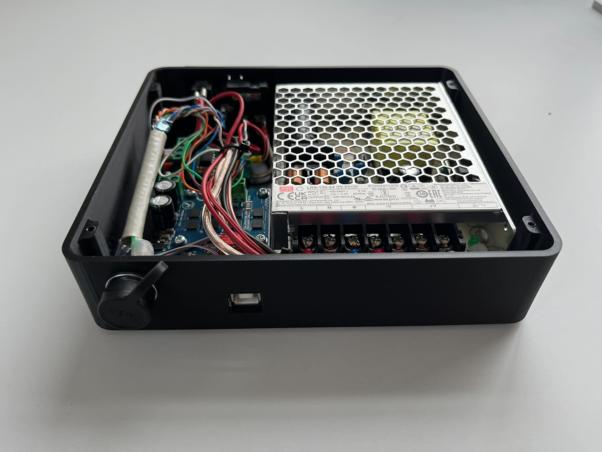
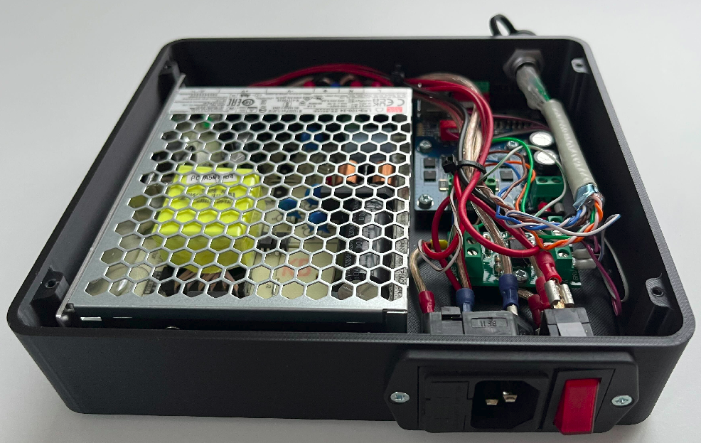

# Mechanical Assembly Guide

## Overview

This document describes the mechanical assembly of the project, including required parts,
sub-modules, and the final assembled result.

The assembly is divided into two main modules:

- [**Module A**](#module-a-assembly)
- [**Module B**](#module-b-assembly)
- [**Electronic Box**](#electronic-box)

Follow the steps in order to ensure correct fit and alignment.

---

## Bill of Materials (BOM)

The full Bill of Materials is provided in the file below:

📄 [**BOM**](./BOM/BOM.xlsx)

## Tools Required

- Metric hex key set (M3, M4, M5)
- Torque wrench (recommended)
  - M3: ~1.2–1.5 Nm
  - M4: ~2.5–3 Nm
  - M5: ~5–6 Nm
- Small flat screwdriver or pick (for magnet placement)
- Calipers (for alignment and magnet depth check)
- Medium-strength threadlocker (Loctite 243 or equivalent)
- Safety gloves (recommended when handling magnets)

---

## Module A Assembly

### Description

Module A consists of the primary mechanical structure and mounting features.

### Exploded View

### Assembly Steps

1. Identify all Module A components using the [BOM](#bill-of-materials-bom).
2. Assemble the base frame components.
3. Install bearings and shafts.
4. Secure fasteners to the specified torque.
5. Verify free movement and alignment.

### Checks

- No binding in moving parts
- All fasteners tightened to spec
- Bearings seated correctly

---

## Module B Assembly

### Description

Module B contains the secondary mechanisms and interfaces with Module A.

### Exploded View

### Assembly Steps

1. Lay out all Module B components.
2. Assemble internal subcomponents.
3. Attach Module B to Module A.
4. Secure mounting fasteners.
5. Verify mechanical engagement.

### Checks

- Proper alignment with Module A
- Smooth actuation
- No interference between components

---

## Electronic Box

| Name                                  | Description                                                                                    | No. of Pieces |
| ------------------------------------- | ---------------------------------------------------------------------------------------------- | ------------- |
| Housing                               | —                                                                                              | 1             |
| Housing Lid                           | —                                                                                              | 1             |
| AC/DC Power Supply                    | [Mean Well LRS-100-24](https://meanwell.si/napajalniki-v-ohisju/594-lrs-100-24-mean-well.html) | 1             |
| Stepper Motor Driver Board            | [PoStep60-256](https://www.poscope.com/product/postep60-256/)                                  | 1             |
| Breakout PCB                          | [Planet-CNC](https://shop.planet-cnc.com/product/optoiso-34-adapter/)                          | 1             |
| IEC C14 Power Inlet                   | —                                                                                              | 1             |
| Connector                             | [WEIPU SF1210/P7](https://www.tme.eu/en/details/sf1210_p7/weipu-connectors/weipu/sf1210-p7i/)  | 1             |
| Screw for plastic 10×3 mm Countersunk | —                                                                                              | 8             |

---

The electronics box provides power distribution and control for the mechanical modules. It houses
the power supply, motor driver(s), and interface electronics required to operate the stepper motors.

All electrical connections to **Module A** and **Module B** are routed through this enclosure to
ensure a clean, protected, and serviceable installation.

### Electronic Box Assembled

The image below shows the electronics box in its fully assembled configuration.

_Figure 1 – Top view of electronics box in fully assembled configuration._

_Figure 2 – Side view of electronics box with USB-B connector and waterproof stepper motor
connector._

_Figure 2 – Side view of electronics box with power connector and power switch._

### Electronic Box Components

## Final Assembly

Once Module A and Module B are complete, inspect the full assembly before operation.

---

## Final Inspection Checklist

- [ ] All components installed per BOM
- [ ] Fasteners torqued correctly
- [ ] No loose or missing parts
- [ ] Moving parts operate smoothly
- [ ] Assembly matches exploded views

---

## Maintenance Notes

- Re-torque fasteners after initial operation.
- Inspect wear components periodically.
- Replace damaged or worn parts immediately.
