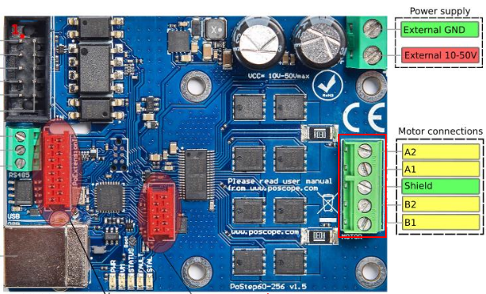
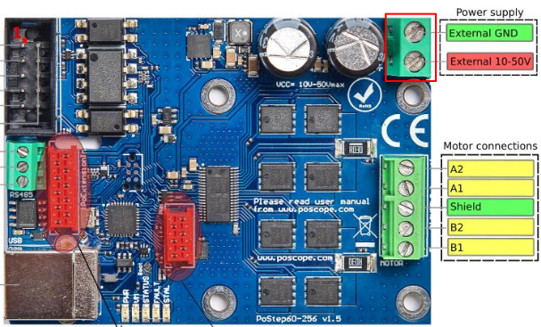

# New Harvest Control Software

This repository contains code related to the New Harvest Control Software.

## Hardware requirements

- PoStep60-256 Stepper motor driver. _TODO_ Verify the stepper motors used in the project.

- 3x 23HS22-1504S Stepper motor.
- 1x Type-A to Type-B USB Cable.

## Configuration

1. Connect the power plug into the wall outlet and into the device. A green light indicator on the
   back side will light up.
2. Connect the PoStep256 Motor driver to your device

   1. Connect the motor connections cable (from the Stepper motor) to the PoStep256 board
      
   2. Connect the power supply cable to the PoStep256 board
      

## Installation and Startup

1. Refer to the **[Installation Guide](../INSTALLATION.md)** - How to install and start the backend
   and frontend services
