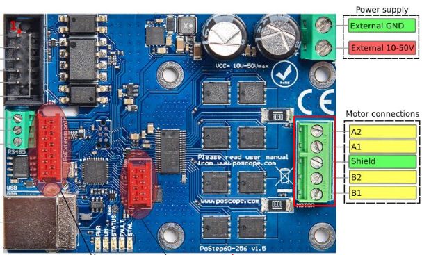
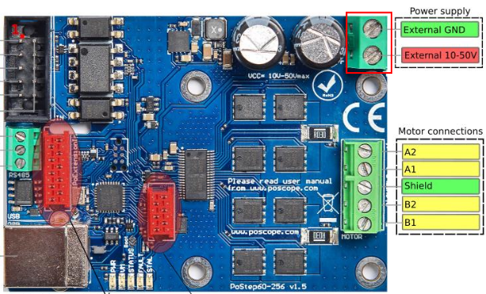

## Hardware requirements

- PoStep60-256 Stepper motor driver. _TODO_ Verify the stepper motors used in the project.

- 3x 23HS22-1504S Stepper motor.
- 1x Type-A to Type-B USB Cable.

## Configuration

1. Connect the power plug into the wall outlet and into the device. A green light indicator on the
   back side will light up.
2. Connect the PoStep256 Motor driver to your device

   1. Connect the motor connections cable (from the Stepper motor) to the PoStep256 board
      
   2. Connect the power supply cable to the PoStep256 board
      

3. Configure Computer Settings to Keep Screen Always On

   ### Windows

   1. Open **Settings** by pressing `Windows + I`.
   2. Navigate to **System → Power & sleep**.
   3. Under **Screen**, set the following options to **Never**:
      - **On battery power, turn off after**
      - **When plugged in, turn off after**
   4. (Optional) For advanced control, click **Additional power settings** → **Change plan
      settings** and set **Turn off the display** to **Never**.
   5. Close Settings to save changes.

   ### Linux

   **Method 1: Using GNOME Settings (Ubuntu, Fedora, etc.)**

   1. Open **Settings**.
   2. Navigate to **Power → Power Saving**.
   3. Set **Blank screen** to **Never**.
   4. Close Settings to save changes.

   **Method 2: Using Command Line (All Distros)**

   - Run the following commands to disable screen blanking and power management:

   ```bash
   xset s off       # Disable screen saver
   xset -dpms       # Disable DPMS (Energy Star) features
   xset s noblank   # Prevent screen from blanking
   ```

> [!NOTE] To make these changes persistent across reboots, add the commands to your shell profile
> (~/.bashrc or ~/.profile).

## Installation and Startup

1. Refer to the **[Installation Guide](../INSTALLATION.md)** - How to install and start the backend
   and frontend services
