# User Guide

For Setting up and Installing the services, follow the guide in documentation

- **[Setup Guide](../setup/README.md)**
- **[Installation Guide](../INSTALLATION.md)**

**Access the service on <http://localhost:5173>**

## Table of contents

- [Guide Files](#guide-files)
- [Web Application Functionalities](#web-application-functionalities)
- [Tilt Motor Page](#tilt-motor-page)
- [Rotary Motor Page](#rotary-motor-page)
- [Peristaltic Motor Page](#peristaltic-motor-page)
- [Peristaltic Calibration](#peristaltic-calibration)
- [Peristaltic Tube Configuration](#peristaltic-tube-configuration)
- [Measurements History](#measurements-history)

## Guide files

- **[Hardware Setup Guide](../setup/README.md)**
- **[Backend System Information](../backend/README.md)**
- **[Frontend System Information](../frontend/README.md)**
- **[Installation Guide](../INSTALLATION.md)**

## Web Application Functionalities

**The Web Application offers different pages with detailed descriptions in the following sections:**

1. Dashboard (For general info about the motors).
2. Tilt Motor (Controlling the tilt movements).
3. Rotary Motor (Controlling the rotation movements).
4. Peristaltic Motor (Controlling the rotation movements for peristaltic motor).
5. Peristaltic Calibration Configuration.
6. Peristaltic Tube Configurations.
7. Measurements History.

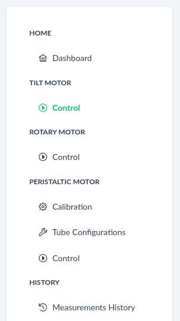

## Tilt Motor Page

### This page supports the following features

- Save scenarios for re-occurring movements.
- Import scenarios from json format.
- Export scenarios to json format.
- Reconfiguring the scenario for one-time tweaking.
- Real-time graph of motor movement.
- Homing of the motor to 0 degree position (horizontal).

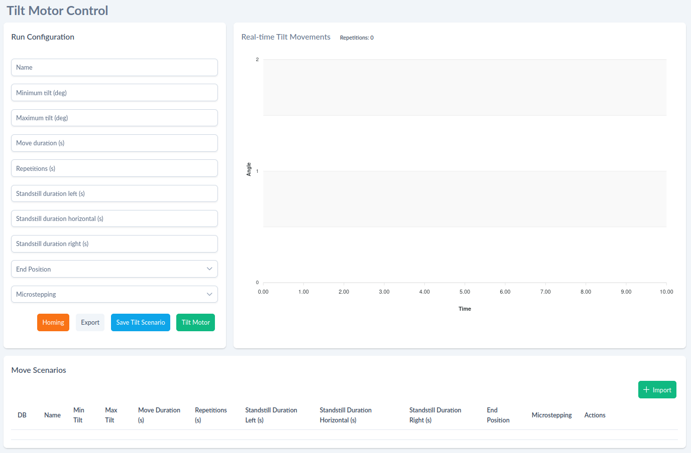

The **Run configuration** section enables us to configure different tilt motor movement
characteristics, such as:

- `Name` for saving the scenario.
- `Min tilt` (minimum value -20 degrees).
- `Max tilt` (maximum value 20 degrees).
- `Move duration` (in seconds).
- `Repetitions` (in seconds).
- `Standstill duration left` (standstill duration for `Min tilt` position in seconds).
- `Standstill duration horizontal` (standstill duration for `0 degree` position in seconds).
- `Standstill duration right` (standstill duration for `Max tilt` position in seconds).
- `End position` (end position of motor after finishing the movements - left/horizontal/right).
- `Microstepping` ( 1/4 step - 1/256 step).

After completing the form fields we can:

1. `Export` the scenario in JSON format, described in section
   [Import/Export Format](#tilt-importexport-format).
2. `Save scenario` to the database.
3. `Tilt motor`to trigger the motor movements.

**NOTE!** Running the scenario by clicking on `Tilt motor` without `Saving scenario` beforehand will
run the scenario without saving it to the database. The scenario will be lost on page change.

In the **Real-time Tilt Movements** Section we can view the real-time tilt movements of the motor:

- `x-axis` is the time duration of the scenario (offset from beginning in seconds).
- `y-axis` is the position of motor in degrees (min tilt - max tilt).
- `repetitions` as number of repetitions of full tilt moves in cycle.

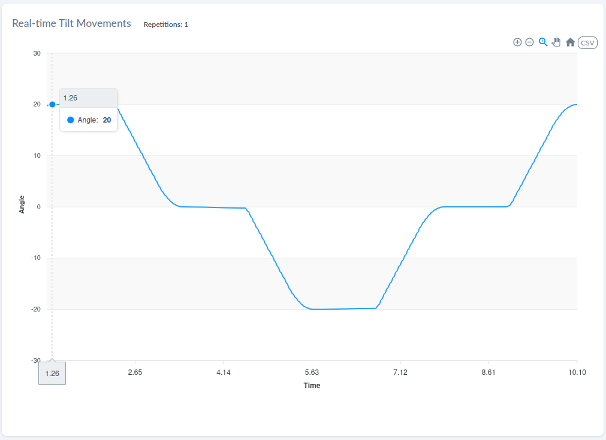

By clicking on the **CSV** button above the movements chart, we can export the completed movements
to csv file in desired filename format:

```text
{prefix}_{scenario_name (if saved)}_{timestamp}.csv
```

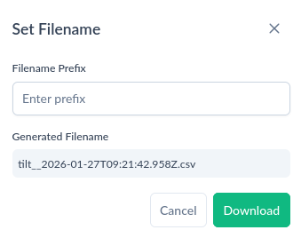

The downloaded file will have **format**:

| Timestamp (ms) | Angle |
| -------------- | ----- |
| 0              | 0     |
| 10             | 1.25  |
| 20             | 4.7   |
| ...            | ...   |

The **Move Scenarios** section displays a table of our saved scenarios:

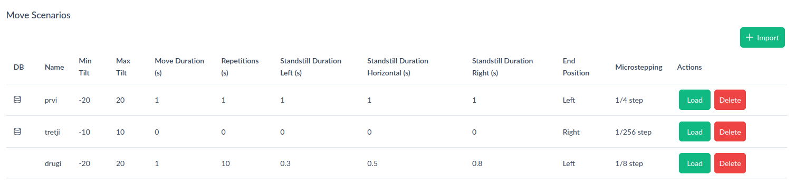

The table contains **12** fields:

- field `DB` displays an icon if the scenario is saved in the database or not.
- field `Name` displays the scenario name.
- field `Min Tilt` displays the minimum tilt degrees of the scenario.
- field `Max Tilt` displays the maximum tilt degrees of the scenario.
- field `Move Duration` displays the duration of one move in seconds.
- field `Standstill Duration Left` displays the standstill duration of left position in seconds.
- field `Standstill Duration Horizontal` displays the standstill duration of horizontal position in
  seconds.
- field `Standstill Duration Right` displays the standstill duration of right position in seconds.
- field `End Position` displays the end position of motor after finishing the scenario.
- field `Microstepping` displays the microstepping setting set for the scenario
- Filed `Actions` allows us to load the scenario to the **Run Configuration** or to delete it.

Pressing the button **Import** in this section allows us to import a scenario from a .json file in
format described in section [Import/Export Format](#tilt-importexport-format)

### Workflow

1. Set the Run Configuration form fields / import and load a scenario.
2. Click on the `Homing` Button to ensure motor is at 0 position.
3. Click on the `Tilt Motor` to start the scenario.
4. Save/Update tilt scenario to the database (Optional).
5. Export the tilt scenario to .json format (Optional).
6. Reconfigure the scenario to your desire.
7. Re-run.

### Tilt Import/Export Format

The format of Run Configuration / Run scenario for import or export is in following format:

```json
{
  "name": "desired_name",
  "min_tilt": min_tilt_degs,
  "max_tilt": max_tilt_degs,
  "repetitions": reps_in_sec,
  "move_duration": move_duration_in_sec,
  "standstill_duration_left": standstill_left_in_sec,
  "standstill_duration_horizontal": standstill_horizontal_in_sec,
  "standstill_duration_right": standstill_right_in_sec,
  "end_position": left/horizontal/right,
  "microstepping": microstepping
}
```

## Rotary Motor Page

### This page supports the following features

- Save scenarios for re-occurring movements.
- Import scenarios from json format.
- Export scenarios to json format.
- Reconfiguring the scenario for one-time tweaking.
- Real-time graph of motor movement.

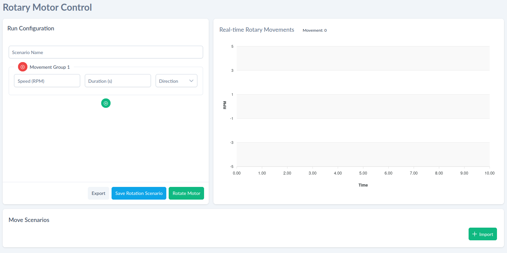

The **Run configuration** section enables us to configure different rotary motor movement
characteristics, such as:

- `Scenario Name` for saving the scenario.
- `Speed (RPM)` speed in rotations per minute.
- `Duration (s)` duration of movement in seconds (0 means no limitation).
- `Direction` direction of movement (clockwise or counter clockwise).
- `+` for adding new movement groups.
- `x` for removing a movement group.

After completing the form fields we can:

1. `Export` the scenario in JSON format, described in section
   [Import/Export Format](#rotary-importexport-format)
2. `Save scenario` to the database.
3. `Rotate motor`to trigger the motor movements.

**NOTE!** Running the scenario by clicking on `Rotate motor` without `Saving scenario` beforehand
will run the scenario without saving it to the database. The scenario will be lost on page change.

In the **Real-time Rotary Movements** Section we can view the real-time rotary movements of the
motor:

- `x-axis` is the time duration of the scenario (offset from beginning in seconds).
- `y-axis` is the current rotations per minute.
- `movement` as number of running movement group.

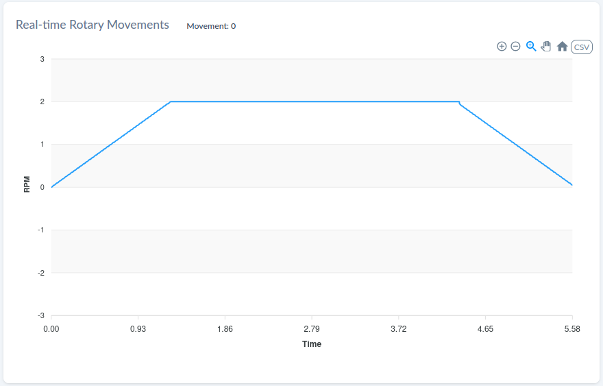

By clicking on the **CSV** button above the movements chart, we can export the completed movements
to csv file in desired filename format:

```text
{prefix}_{scenario_name (if saved)}_{timestamp}.csv
```


The downloaded file will have format:

| Timestamp (ms) | RPM  |
| -------------- | ---- |
| 0              | 0    |
| 10             | 0.1  |
| 20             | 0.25 |
| ...            | ...  |

The **Move Scenarios** section displays a table of our saved scenarios:

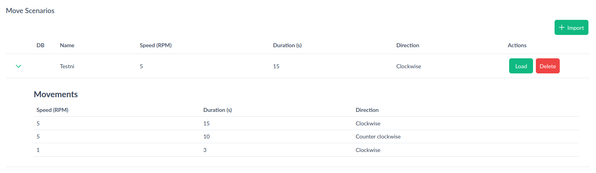

The table contains **5** fields:

- field `DB` displays an icon if the scenario is saved in the database or not.
- field `Name` displays the scenario name.
- field `Speed (RPM)` displays the speed of the movement in rotations per minute.
- field `Duration (s)` displays the duration of the movement.
- field `Direction` displays the direction of the movement (clockwise/counter clockwise).
- Filed `Actions` allows us to load the scenario to the **Run Configuration** or to delete it.

Pressing the button **Import** in this section allows us to import a scenario from a .json file in
format described in section [Import/Export Format](#rotary-importexport-format)

### Workflow

1. Set the Run Configuration form fields / import and load a scenario.
2. Click on the `Rotate Motor` to start the scenario.
3. Save/Update rotary scenario to the database (Optional).
4. Export the rotary scenario to .json format (Optional).
5. Reconfigure the scenario to your desire.
6. Re-run.

### Rotary Import/Export Format

The format of Run Configuration / Run scenario for import or export is in following format:

```json
{
  "name": "Rotary format",
  "movements": [
    {
      "duration": 15,
      "direction": "cw",
      "rpm": 5
    },
    {
      "duration": 10,
      "direction": "ccw",
      "rpm": 5
    },
    {
      "duration": 3,
      "direction": "cw",
      "rpm": 1
    }
  ]
}
```

## Peristaltic Motor Page

### This page supports the following features

- Save scenarios for re-occurring movements.
- Import scenarios from json format.
- Export scenarios to json format.
- Reconfiguring the scenario for one-time tweaking.
- Real-time graph of motor movement.

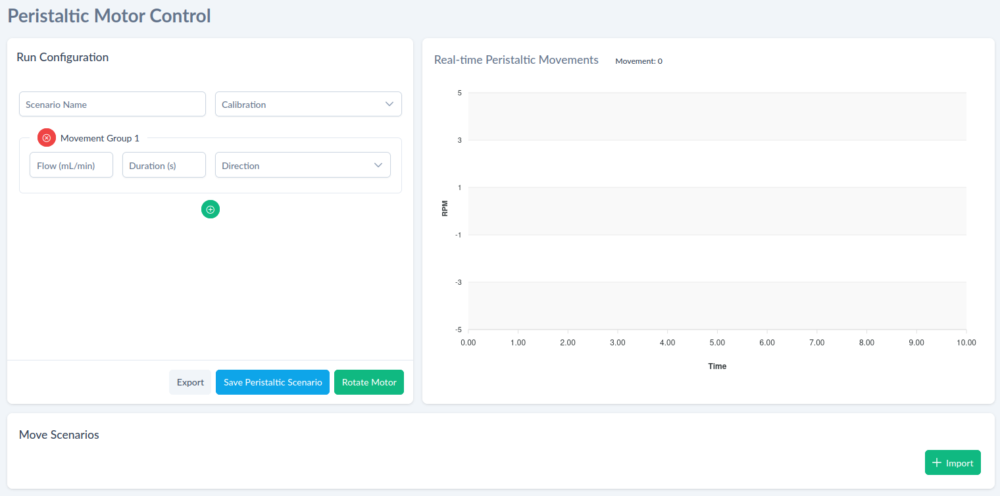

The **Run configuration** section enables us to configure different peristaltic motor movement
characteristics, such as:

- `Scenario Name` for saving the scenario.
- `Calibration` for selecting the correct calibration setting.
- `Flow (mL/min)` speed in rotations per minute.
- `Duration (s)` duration of movement in seconds (0 means no limitation).
- `Direction` direction of movement (clockwise or counter clockwise).
- `+` for adding new movement groups.
- `x` for removing a movement group.

After completing the form fields we can:

1. `Export` the scenario in JSON format, described in section
   [Import/Export Format](#peristaltic-importexport-format)
2. `Save scenario` to the database.
3. `Rotate motor`to trigger the motor movements.

**NOTE!** Running the scenario by clicking on `Rotate motor` without `Saving scenario` beforehand
will run the scenario without saving it to the database. The scenario will be lost on page change.

In the **Real-time Peristaltic Movements** Section we can view the real-time rotary movements of the
peristaltic motor:

- `x-axis` is the time duration of the scenario (offset from beginning in seconds).
- `y-axis` is the current rotations per minute.
- `movement` as number of running movement group.

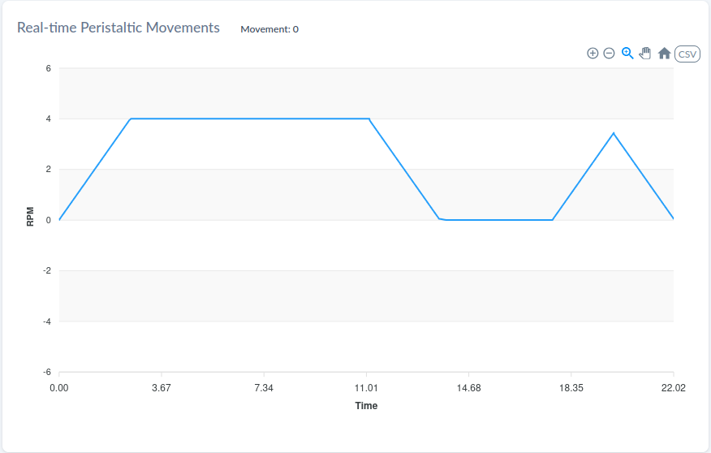

By clicking on the **CSV** button above the movements chart, we can export the completed movements
to csv file in desired filename format:

```text
{prefix}_{scenario_name (if saved)}_{timestamp}.csv
```


The downloaded file will have **format**:

| Timestamp (ms) | RPM  |
| -------------- | ---- |
| 0              | 0    |
| 10             | 0.1  |
| 20             | 0.25 |
| ...            | ...  |

The **Move Scenarios** section displays a table of our saved scenarios:

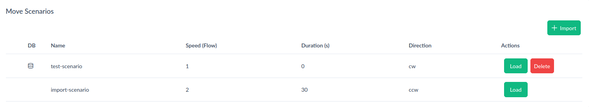

The table contains **5** fields:

- field `DB` displays an icon if the scenario is saved in the database or not.
- field `Name` displays the scenario name.
- field `Speed (Flow)` displays the speed of the movement in flow (mL/min).
- field `Duration (s)` displays the duration of the movement.
- field `Direction` displays the direction of the movement (clockwise/counter clockwise).
- Filed `Actions` allows us to load the scenario to the **Run Configuration** or to delete it.

Pressing the button **Import** in this section allows us to import a scenario from a .json file in
format described in section [Import/Export Format](#peristaltic-importexport-format)

### Workflow

1. Set the Run Configuration form fields / import and load a scenario.
2. Click on the `Rotate Motor` to start the scenario.
3. Save/Update peristaltic scenario to the database (Optional).
4. Export the peristaltic scenario to .json format (Optional).
5. Reconfigure the scenario to your desire.
6. Re-run.

### Peristaltic Import/Export Format

The format of Run Configuration / Run scenario for import or export is in following format:

```json
{
  "name": "Peristaltic format",
  "movements": [
    {
      "duration": 15,
      "direction": "cw",
      "rpm": 5
    },
    {
      "duration": 10,
      "direction": "ccw",
      "rpm": 5
    },
    {
      "duration": 3,
      "direction": "cw",
      "rpm": 1
    }
  ],
  "calibration": {
    "id": 1,
    "name": "calibration",
    "diameter": 1.42,
    "flow_rate": 0.25,
    "preset": true
  }
}
```

## Peristaltic Calibration

### This page supports the following features

- Configure the peristaltic motor using flow calibration.
- Save the calibration file locally.

The **Peristaltic Motor Calibration** Guides the user through flow caliberation in 4 steps.

1. **Duration selection**

   ```text
   Choose the duration of the rotation movement for calibration.
   The unit can be selected from the dropdown menu (seconds or minutes).
   Used to calculate the slope relation between RPM and flow rate.
   ```

   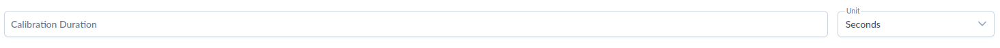

2. **Low RPM**

   ```text
   Choose the low RPM for the calibration movement.
   After the movement is finished, measure the volume of fluid that has passed
   through the tube (in mL).
   ```

   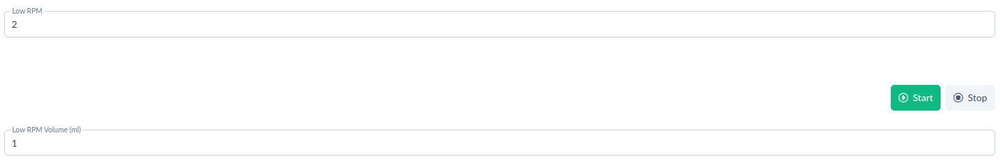

3. **High RPM**

   ```text
   Choose the high RPM for the calibration movement.
   After the movement is finished, measure the volume of fluid that has passed
   through the tube (in mL).
   ```

   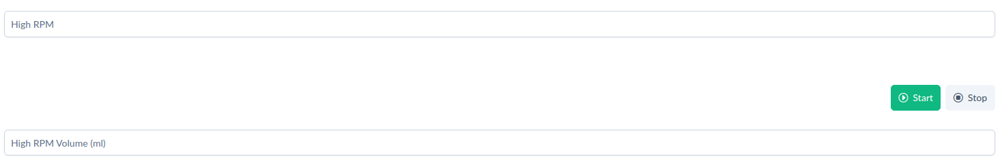

4. **File selection**

   ```text
   Choose the file name for the calibration.
   This name is used to save the calibration data.
   After clicking the "Finish Calibration" button, the data is saved to a file.
   ```

   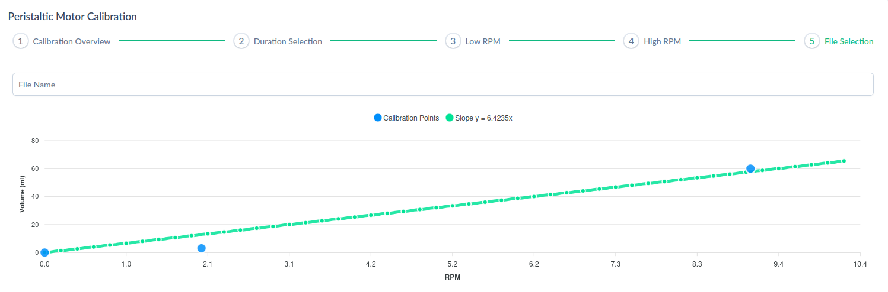

The calibration returns a **slope** of our flow calibration, which is a linear regression function
depending on our **Low RPM Flow** and **High RPM Flow**. The calibration can eventually be used in
Peristaltic Motor Control.

### Workflow

1. Select the calibration movement duration from the dropdown.
2. Run the motor with desired Low RPM speed.
3. Input the Low RPM Volume (measured in ml).
4. Run the motor with desired High RPM speed.
5. Input the High RPM Volume (measured in ml).
6. Save the calibration file with calculated slope and calibration data.

## Peristaltic Tube Configuration

### This page supports the following features

- View all the preset tube configurations.
- Add new tube configurations.
- View all calculated flow calibrations.
- Add new flow calibrations.
- Edit the flow (mL/rotation) of existing entries.

By default, the application has 6 tube configurations preset. these will be displayed with a green
tag **Preset**. 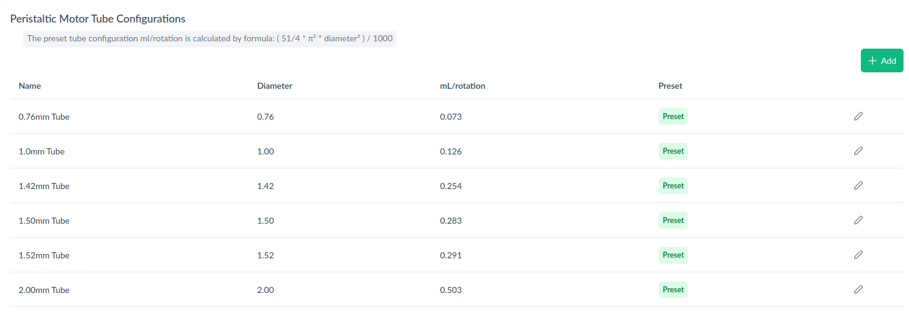

Additionally, we can add new tube configurations or calibrations. Depending on the type of entry,
the required form fields need to be completed.

For configuration **type** of `tube configuration`:

- field `Name` for the name of configuration to be displayed.
- field `Diameter` for the diameter of the tube.
- field `Flow Rate` for flow rate of the tube.

**NOTE!** Flow rate for tube configurations are calculated by **formula**:

```math
\frac{51}{4} \cdot \frac{\pi^2 \cdot \text{diameter}^2}{1000}
```

For configuration **type** of `flow calibration`:

- field `Duration` for movement duration during calibration.
- field `Low RPM` for speed in rotations per minute during calibration for Low RPM Volume.
- field `High RPM` for speed in rotations per minute during calibration for High RPM Volume.
- field `Low RPM Volume` for measured flow volume after the calibration duration period.
- field `High RPM Volume` for measured flow volume after the calibration duration period.đ
- field `Filename` for desired filename under which the calibration is saved.


By clicking on the icon, we can update the mL/rotation value of the entry.

## Measurements History

### This page supports the following features

- Select measurement entries from history list and display them in a chart.
- Download the entry in csv format.

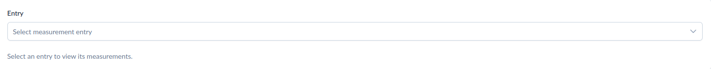

The **Measurement History** page loads all of the entries that were previously done. It combines
entries of all three types (tilt, rotary, peristaltic). Each of the measurements can be downloaded
to csv file after displaying it by pressing the **CSV** button.

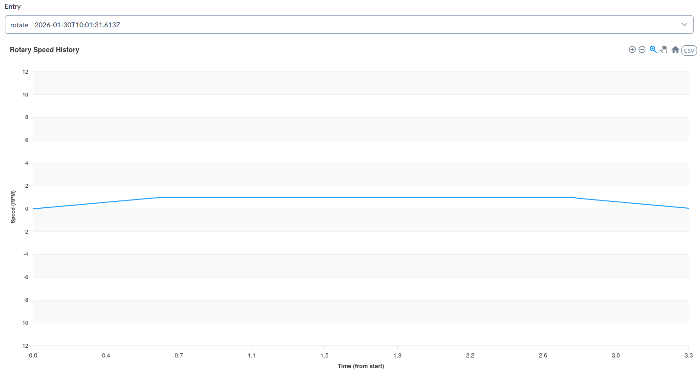

## Workflow

1. Select measurement entry of any type (tilt, rotate, peristaltic).
2. Display the measurement entry in chart.
3. Download the csv file of the measurement entry.
