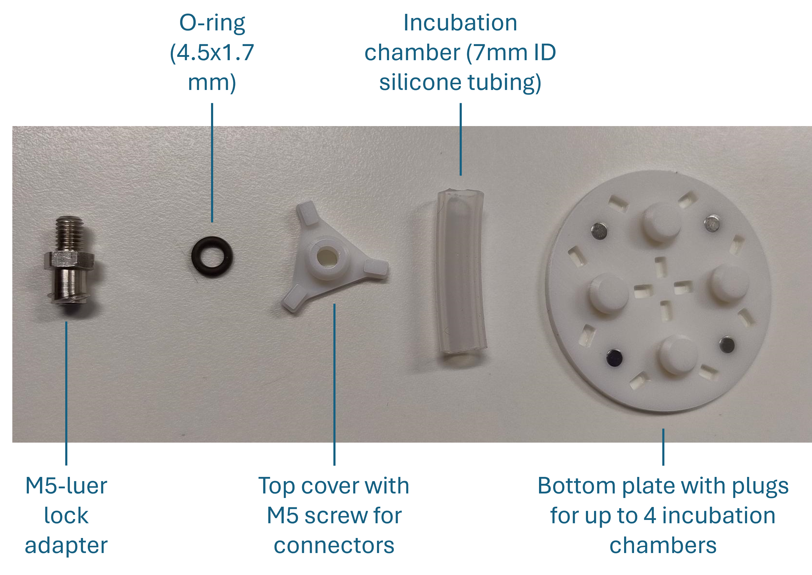
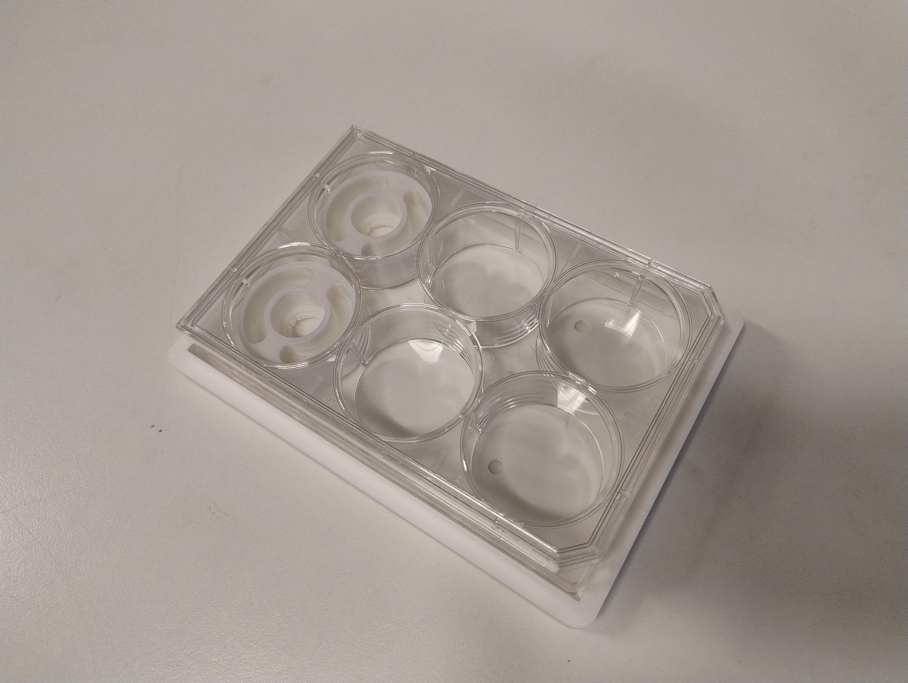
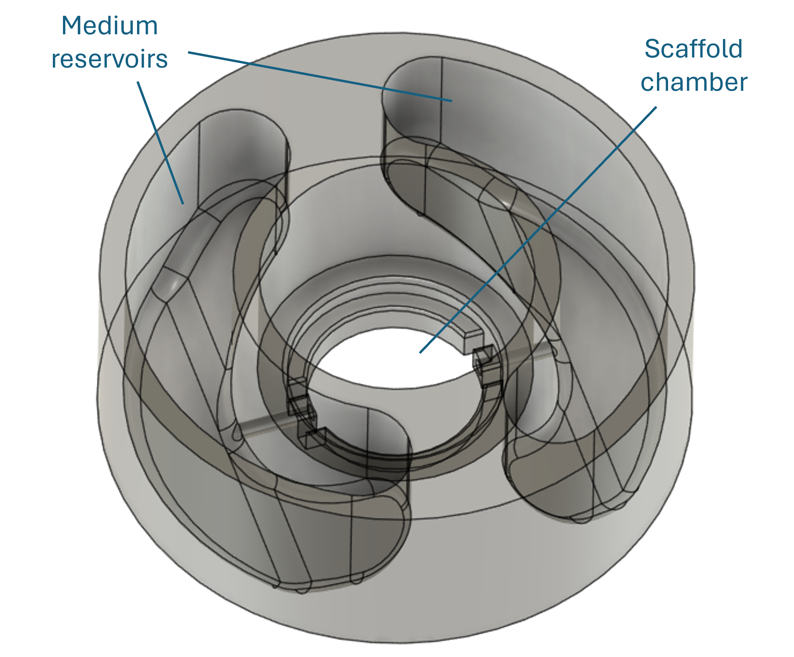

# Liquid handling
This folder contains use-cases examples and design files for liquid handling components that demonstrate potential applications of the hardware modules described in this repository.

## Peristaltic Module
Peristaltic pumping is a standard method for liquid transfer in laboratory, as well as inudstrial applications that enables controlled medium exchange and shear force generation, suitable for adherent cultures on flat substrates and within tissue scaffolds. The [peristaltic module](https://github.com/Institute-of-Biomedical-Sciences/dynamic-cell-culture-drive/edit/main/docs/assembly/README.md#peristaltic-module-assembly) is compatible with [Ismatec® Minicartridge Pump Heads](https://www.avantorsciences.com/si/sl/product/38670060/masterflex-ismatec-minicartridge-pump-heads-for-3-stop-tubing-avantor) that allow perfusion using microbore tubing with an inner diameter of up to 2.79mm.

## Rotary Module
The rotary module allows continuous rotation of enclosed culture chambers containing suspension-, cell aggregate- or microcarrier-based cultures. The rotary module concept described here is built as as platform that can hold up to 4 small chambers created using semi-permeable silicone tubing. The designs in this repository fit flexible tubing with an inner diameter of 7mm, which calculates to an internal volume of approx. 380ul for each cm of tubing lentgh and can be adjusted to expreimental requirements as necessary. The tubing is closed with a barbed cap that also features an M5 screw for connector attachment to fill/empty the chamber. The components and assembly are shown in Figures 1 and 2. The rotary chamber platform is fixed to the rotary module using 4 neodynium magnets with dimensionso f 4x2mm.

Figure 1: Rotary bioreactor concept design with annotations.

Figure 2: Rotary bioreactor components.

## Rocking Motion Module
Rocking motion allows gentle perfusion through oscillating movements that drive liquid flow in closed systems and is commonly used for wave bioreactors (sterile, single use bags in a thermoregulated environment with support for gas exchange). The rocking motion module described here supports such, programmable rocking motion for both single-use bioreactors, as well as custom-made microphysiological systems with integrated scaffold-based cellular structures. Here we present a lab-scale set-up for P6 well plate-compatible microfluidic chips that provide medium exchange to 3D (bio)printed scaffolds through rocking motion. The use-case presented here is aimed at perfusion of 3D bioprinted scaffolds in P6 well plates. The set-up contains a multi-well plate holder and millifluidic chip for P6 well plate integration. The multi-well palte holder is fixed on the [rocking motion module](https://github.com/Institute-of-Biomedical-Sciences/dynamic-cell-culture-drive/edit/main/docs/assembly/README.md#module-b-assembly) using 4x2 neodynium magnets. The holder has chamfered inner walls, supporting stable installation of multiwellplates from different producers. Each millifulidic chip fit's precisely into an individual P6 well. The assembly and components are shown in the figures below.

Figure 3: Aasembly of the P6 rocking perfusion components (Plate holder, P6 well plate, 2x millifluidic chips).

A schematic of an individual millifluidc chip is shown below. The chip contains two medium reservoirs, which connect with a central chamber at the bottom, where a scaffold can be 3D bioprinted. By alternating the inclination of the plate, a height difference between the reservoirs is created, driving medium flow through the central chamber in the downward direction.

Figure 4: Millifluidic chip design sketch.
